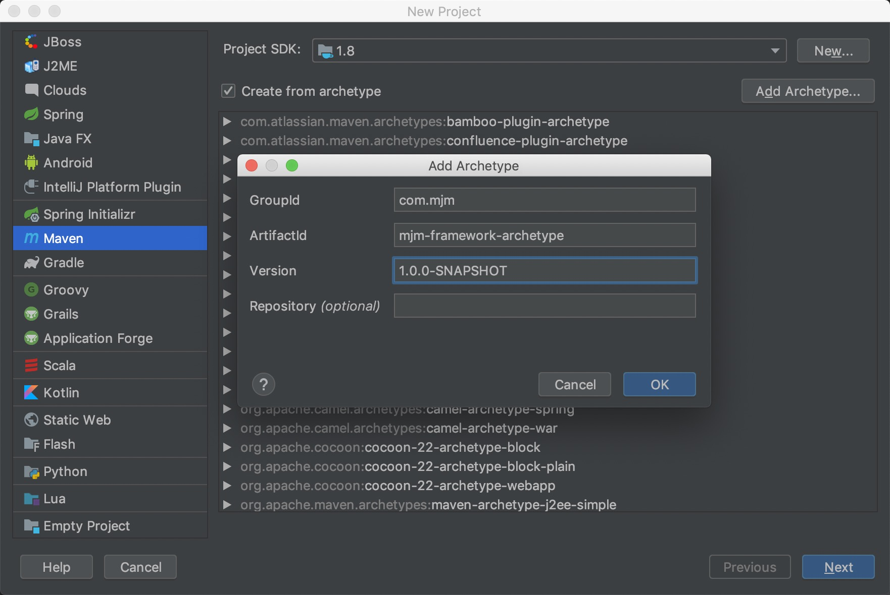

## 使用方法

```
在本目录下执行 

mvn clean install -DskipTests  安装到本地
```

1. 命令行
```sh
mvn archetype:generate -DgroupId=com.mjm.demo2 -DartifactId=demo2 -Dversion=1.0.0-SNAPSHOT -Dpackage=com.mjm.demo2 -DarchetypeArtifactId=mjm-framework-archetype -DarchetypeGroupId=com.mjm -DarchetypeVersion=1.0.0-SNAPSHOT

```


2. 导入到 idea



下一步输入 
artifactId:demo1
groupId:com.mjm

并增加参数指定 package: com.mjm.demo1


